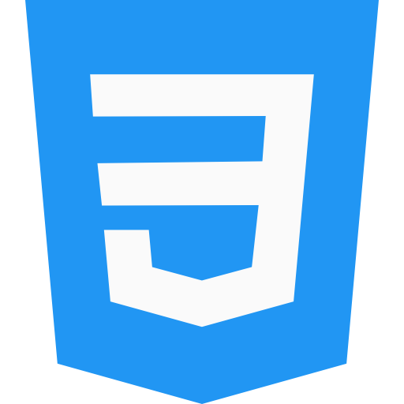

# 👋 Hi there I'm Delphine, a French gal, a wanderluster who loves to learn 👩🏾‍💻

- 🌱 I’m currently learning **Javascript** and **TypeScript** in order to become a FullStack Dev.
- 🔭 I am soon passing my French FullStack Dev diploma
- My portfolio is a work in progress
- 💻 My future goal is to enroll into the Apple Developper Academy. iOS junior dev.

#### - 🚨 I am actively looking for an internship. You can look up my <a href="https://delphine-t-2669.com](https://portfolio.delphine-t-2669.com/resume">Resume</a>

## Languages

## Dev Tools

## Let's connect 🤝

